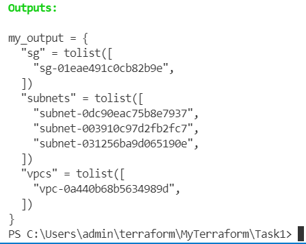

# Task1
•	Скачать последнюю версию terraform
•	Написать terraform манифест, который с помощью data source сущностей получает из облака информацию о AWS VPC/Azure virtual network, subnets и security groups 
•	Вывести в оутпут имена AWS VPC/Azure virtual network, subnets и security groups

### Solution
```bash
terraform apply
```
### Result

