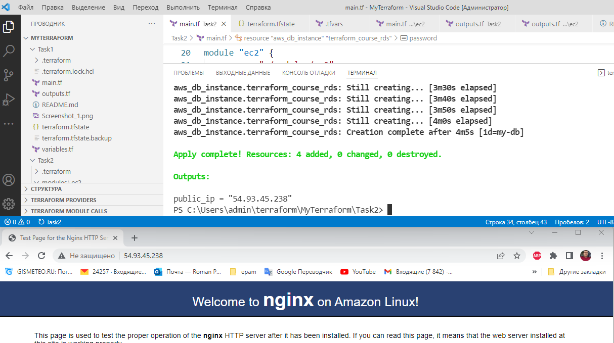

# Task2
•	Написать terraform манифест для разворачивания AWS EC2/Azure VM. Этот инстанс должен содержать nginx. Nginx должен быть установлен во время провиженинга инстанса, например с помощью user data.
•	(Дополнительно) Добавить в манифест код для создания базы данных AWS RDS/Azure Database. Тип базы на ваше усмотрение. 

### Solution
Переменные для БД вынес в файл.

```bash
>type .tfvars
my_username = "admin"
my_password = "1233421123"
>terraform.exe apply -var-file=".tfvars"
```

### Result

